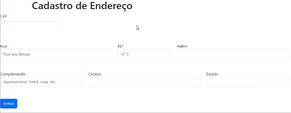

# Índice 

[Formulário de Cadastro de Endereço]()  
[Descrição](#descri%C3%A7%C3%A3o)  
[Instruções de Uso]()  
[Funcionalidades](#funcionalidades)  
[Composição do Projeto]()
[Tecnologias Utilizadas](#tecnologias-utilizadas)  
[Fontes consultadas](#fontes-consultadas)  
[Colaboradores](#colaboradores)  
[Autores](#autores)  

# Formulário de Cadastro de Endereço

# 📌Formulário de Cadastro de Endereço

 ## 📝Descrição

 * Este é um projeto simples de cadastro de endereço que permite consultar facilmente informações de domicílio por meio de uma interface as informações de endereço a partir de um CEP (código postal) fornecido.

 ## 👾Instruções de Uso

 * Abra o arquivo 'index.html' em um navegador web;
 * Preencha os campos do formulário com as informações de endereço desejadas;
 * Clique no botão "Entrar" para enviar o formulário.

 ## 🔛Funcionalidades  

  1. Cadastro de Endereço:  
    * O formulário permite aos usuários inserirem as seguintes informações de endereço:  
   
    * Rua    
    * Número  
    * Bairro  
    * Complemento (opcional)  
    * Cidade  
    * Estado  

  2. Consulta Automática de CEP:  

    * Quando o usuário insere um CEP válido no campo correspondente, o sistema automaticamente realiza uma consulta à API ViaCEP para obter e preencher os campos de rua, bairro, cidade e estado.  

  3. Estilização Responsiva:  

    * O projeto possui estilos CSS que garantem uma boa aparência e usabilidade tanto em dispositivos desktop quanto em dispositivos móveis.  

 ## ⚙️Composição do Projeto  

 * 'index.html' : Contém a estrutura HTML do formulário de cadastro de endereço.  
 * 'main.css' : Arquivo de estilo para personalizações adicionais.  
 * 'controller.js' : Script JavaScript para lidar com a consulta de CEP e preenchimento automático dos campos de endereço.  

 ## ⌨️Tecnologias Utilizadas

 * Css  
 * HTML  
 * GitHub  
 * Javacript  
 * BootStrap  

 ## 📑Fontes consultadas

 ## 🤝🏻🤝🏻Colaboradores

 * [Professor Leonardo Rocha](https://github.com/LeonardoRochaMarista)
 * [Leonardo Rocha](https://github.com/LeonardoRochaMarista)

 ## ✒️Autores
 * Esse projeto foi criado por [Jasminy Matias e Silva](https://github.com/jamybr)

